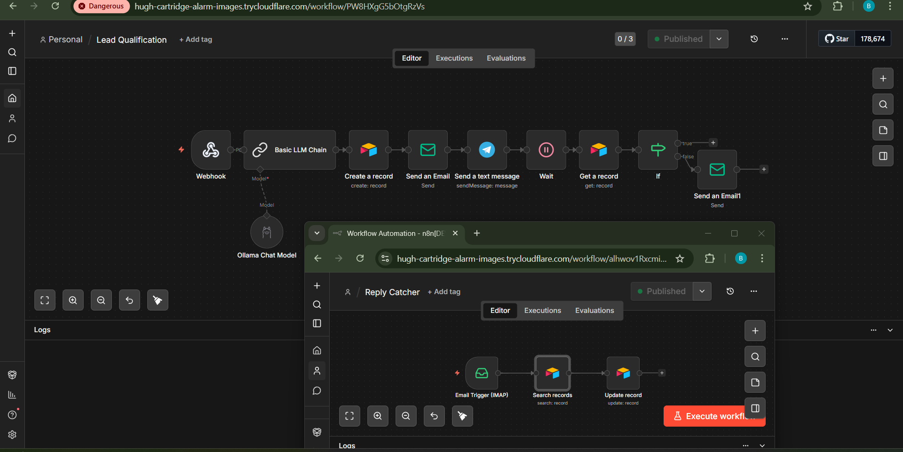

# Automated Lead Pipeline

## What Problem It Solves

Most businesses lose leads not because their product is bad — but because nobody followed up fast enough. This system ensures every lead gets an instant response and an automatic follow-up if they go quiet, without anyone doing it manually.

## Who It's Built For

SMEs, digital agencies, real estate companies, and any founder running paid ads or inbound forms who is losing deals to slow follow-up.

## What It Does

- Captures lead details the moment a Google Form is submitted
- Uses AI to instantly classify the lead as **HOT**, **WARM**, or **COLD**
- Stores every lead automatically in Airtable with their classification
- Sends the lead a personalised email within seconds of submitting
- Alerts the business owner on Telegram immediately
- Waits 24 hours and checks if the lead replied
- If no reply — sends a follow-up email automatically
- If they replied — stops, no follow-up sent

## Tools Used

| Tool | Purpose |
|---|---|
| n8n | Workflow automation |
| Ollama (llama3) | AI lead classification |
| Google Forms | Lead capture form |
| Airtable | Lead database |
| Gmail (SMTP) | Email delivery |
| Telegram Bot | Owner alert system |
| Cloudflare Tunnel | Public webhook URL |


## Workflow Overview

```
Google Form (lead submits)
  → Webhook triggers n8n
  → Ollama classifies lead (HOT / WARM / COLD)
  → Airtable stores lead + classification
  → Gmail sends personalised first email instantly
  → Telegram alerts owner
  → Wait 24 hours
  → Airtable checks: did they reply?
      YES → Stop (no follow-up needed)
      NO  → Gmail sends follow-up email

Background (Reply Catcher — runs 24/7):
  IMAP watches inbox every minute
  → Finds lead in Airtable by email
  → Ticks Replied checkbox automatically
```

## Screenshot



## How to Use It

1. Clone this repo
2. Set up n8n (self-hosted or cloud)
3. Import the workflow JSON into n8n
4. Create a Telegram bot via [@BotFather](https://t.me/botfather)
5. Set up an Airtable base with these columns:
   - Full Name, Email, Business Name, Product, Revenue Range, Urgency, AI Classification, Date Received, Replied (Checkbox)
6. Connect Gmail via SMTP App Password
7. Point your Google Form webhook to your n8n URL
8. Publish and activate both workflows

## What It Costs a Client

| | Price |
|---|---|
| Setup fee | ₦150,000 – ₦300,000 |
| Monthly retainer | ₦50,000/month |
| Leads handled automatically | Unlimited |

---

*Built by **Ibukun Samuel Babalola** — AI Security Automation Engineer*
