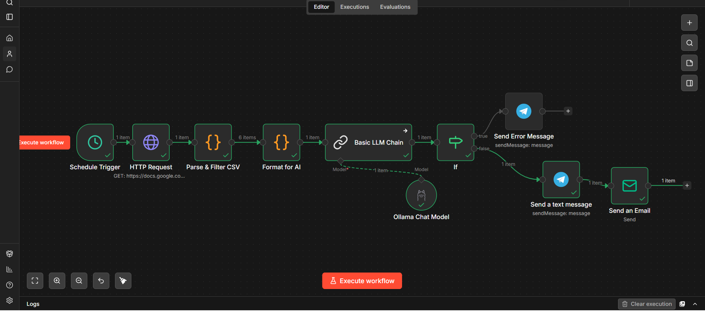

# Automated Weekly Business Report

## What Problem It Solves

Most small business owners have no idea how their week went until Sunday night — by then it's too late to act. This system delivers a clear, AI-written business summary every Monday at 7AM automatically, so owners start the week informed and ready to move.

## Who It's Built For

SMEs, retail stores, logistics companies, digital agencies, and any founder with a team of 3+ people who currently has no visibility into weekly performance.


## What It Does

- Runs automatically every Monday at 7AM — no trigger needed
- Reads the week's sales data directly from Google Sheets
- Filters only the current week's records
- Uses AI to write a plain-English 5-sentence business summary covering:
  - Total revenue for the week
  - Completed sales vs pending
  - Best performing product or service
  - Any pattern worth noting
  - One specific action to take next week
- Delivers the summary to the owner's email and Telegram simultaneously
- If AI fails — sends an error alert to Telegram automatically


## Tools Used

| Tool | Purpose |
|---|---|
| n8n | Workflow automation |
| Ollama (llama3) | AI summary generation |
| Google Sheets | Sales data source |
| Gmail (SMTP) | Email delivery |
| Telegram Bot | Instant mobile delivery |
| Cloudflare Tunnel | Public webhook URL |


## Workflow Overview

```
Schedule Trigger (Every Monday 7AM)
  → Read Weekly Sales Data (Google Sheets CSV)
  → Parse + Filter This Week's Data (Code node)
  → Format Data for AI (Code node)
  → Generate Business Summary (Ollama)
  → Did Ollama Respond? (IF node)
      SUCCESS → Send Report to Telegram + Email
      FAILED  → Send Error Alert to Telegram
```


## Screenshot




## Sample AI Output

> "This week your business generated ₦487,000 in total revenue across 12 sales. 9 of those were fully paid while 3 are still pending — worth following up on before Wednesday. Your best performer was the Corporate Uniforms order at ₦150,000, coming through a referral. Instagram is consistently your strongest lead source, bringing in 5 of your 12 customers this week. Next week, consider running a quick Instagram story promoting your top product — your audience there is ready to buy."


## How to Use It

1. Clone this repo
2. Set up n8n (self-hosted or cloud)
3. Create your Google Sheet with these columns:
   - Date, Customer Name, Product or Service Sold, Amount (₦), Status, Lead Source
4. Publish the sheet as CSV (File → Share → Publish to web → CSV)
5. Add the CSV URL to the HTTP Request node in n8n
6. Connect Gmail via SMTP App Password
7. Set up a Telegram bot via [@BotFather](https://t.me/botfather)
8. Publish and activate the workflow


## What It Costs a Client

| | Price |
|---|---|
| Setup fee | ₦120,000 – ₦250,000 |
| Monthly retainer | ₦60,000/month |
| Time saved per week | 2–3 hours |
| Revenue impact | 10–20% monthly uplift from better decisions |


## Files in This Folder

| File | Description |
|---|---|
| `README.md` | This file |
| `workflow-screenshot.png` | n8n canvas screenshot |
| `sample-data.csv` | Sample Google Sheet structure |
| `ollama-prompt.txt` | The exact AI prompt used |

---

*Built by **Ibukun Samuel Babalola** — AI Security Automation Engineer*
